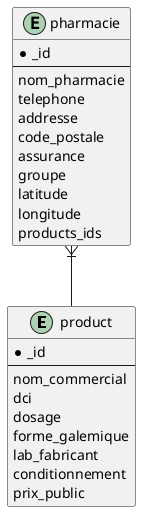

# Projet: pharmacies
**Objectif global:**
- Contribuer à améliorer la santé de la population

**Objectifs spécifiques:**
- Permettre aux utilisateurs de trouver la pharmacie la plus proche (jour ouvrable ou garde) disposant du médicament.
- Permettre aux utilisateurs d’entrer en contact avec un médecin à proximité.
- Permettre aux utilisateurs de trouver la formation sanitaire la plus proche.

# Membres du groupe
- [KABORE Abdoul Fataoh](abdoulfataoh@gmail.com)
- OUEDRAOGO Ibrahim Allasane
- OUEDRAOGO Ibrahim 
- ROBGO Karima

# Ressources

[Toutes les ressources(lien)](https://drive.google.com/drive/folders/1oyWhHtyosVzUHSvEOt_HuW_dcJ0dEvfP?usp=sharing)


# Structure de stockage dans la base de donnees des produits

```javascript
    {
        "_id": ObjectId(<hexadecimal>)
        "nom_commercial": <str>, 
        "dci": <[str, str, ...]>,
        "dosage":  <str>,
        "forme_galemique": <str>,
        "lab_fabricant": <str>,
        "conditionnement": <str>,
        "prix_public": float

    }
```

# Structure de stockage dans la base de donnees des pharmacies


```javascript
    {
        "_id": ObjectId(<hexadecimal>)
        "nom_pharmacie": <str>, 
        "telephone": <[str, str, ...]>,
        "addresse": <str>,
        "code_postale": <str>,
        "assurance": <[str, str, ...]>,
        "groupe": <str>,
        "localisation": {"Point": latitude: <float>, longitude: <float>]}
        "products_ids": <[ObjectId(<hexadecimal>), ObjectId(<hexadecimal>), ...]>,
    }
```


3. relationship between pharmacies collection and products collection


