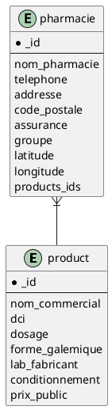

# Data structure 


1. Products data structure

```javascript
    {
        "_id": ObjectId(<hexadecimal>)
        "nom_commercial": <str>, 
        "dci": <[str, str, ...]>,
        "dosage":  <str>,
        "forme_galemique": <str>,
        "lab_fabricant": <str>,
        "conditionnement": <str>,
        "prix_public": float

    }
```

2. Pharmacies data structure


```javascript
    {
        "_id": ObjectId(<hexadecimal>)
        "nom_pharmacie": <str>, 
        "telephone": <[str, str, ...]>,
        "addresse": <str>,
        "code_postale": <str>,
        "assurance": <[str, str, ...]>,
        "groupe": <str>,
        "latitude": <float>,
        "longitude": <float>
        "products_ids": <[ObjectId(<hexadecimal>), ObjectId(<hexadecimal>), ...]>,
    }
```


3. relationship between pharmacies collection and products collection


