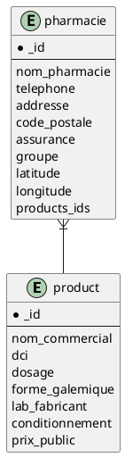

# Projet: pharmacies
**Objectif global:**
- Contribuer à améliorer la santé de la population

**Objectifs spécifiques:**
- Permettre aux utilisateurs de trouver la pharmacie la plus proche (jour ouvrable ou garde) disposant du médicament.
- Permettre aux utilisateurs d’entrer en contact avec un médecin à proximité.
- Permettre aux utilisateurs de trouver la formation sanitaire la plus proche.

# Membres du groupe
- [KABORE Abdoul Fataoh](abdoulfataoh@gmail.com)
- OUEDRAOGO Ibrahim Allasane
- OUEDRAOGO Ibrahim 
- ROBGO Karima

# Ressources

[Toutes les ressources (cliquez ici) ](https://drive.google.com/drive/folders/1oyWhHtyosVzUHSvEOt_HuW_dcJ0dEvfP?usp=sharing)


# Structure de stockage dans la base de donnees des produits

```javascript
    {
        "_id": ObjectId(<hexadecimal>)
        "nom_commercial": <str>, 
        "dci": <[str, str, ...]>,
        "dosage":  <str>,
        "forme_galemique": <str>,
        "lab_fabricant": <str>,
        "conditionnement": <str>,
        "prix_public": float

    }
```

# Structure de stockage dans la base de donnees des pharmacies


```javascript
    {
        "_id": ObjectId(<hexadecimal>)
        "nom_pharmacie": <str>, 
        "telephone": <[str, str, ...]>,
        "addresse": <str>,
        "code_postale": <str>,
        "assurance": <[str, str, ...]>,
        "groupe": <str>,
        "localisation": {"Point": latitude: <float>, longitude: <float>]}
        "products_ids": <[ObjectId(<hexadecimal>), ObjectId(<hexadecimal>), ...]>,
    }
```

# Relation entre produits et pharmacies


# struture du projet
- ```/utils``` contient les utilitaires
- ```/mongo_wrapper``` contient une classe ui est l'interface de communication entre les taches et la base de donnees
- ```/recipes``` contient des recettes qui permettent de faire des operations conrantes telque l'import des produits et pharmacies
- ```/api``` contient fichiers de configurations et le controleur de swagger
- ```/data``` contient des fichiers ressources du projet


# Demarrage de la base de donnees 

```
docker container run -itd  --name  uvbf-mongodb -p 27017:27017 mongo
```

# creation de la base de donnees et des collections

(Ces etapes ne sont pas neccessaires, ils sont crees automatiquement par le programme)

```
docker container exec -it uvbf-mongodb bash
mongo
use pharmacies
db.createCollection('products_listing')
db.createCollection('pharmacies_listing')
```


# Import des produits depuis une feuille excel
Le script ```recipes/recipe-import-products.py``` permet de formater et d'importer depuis une feuille excel les produits.
Ses fonctionnalites sont:
- transformation des caractères en minuscule et suppression des espaces inutiles
- Convertir une cellule contenant une liste des d'éléments séparés par un marqueur(exemple le virgule) en tableau d'éléments. 
	par exemple la cellule contenant le DCI "artémether, luméfantrine" transformes en [ "artémether", "luméfantrine"] pendant l'import

Pour eviter l'importation de donnees qui ne respecte pas la strucutre(notre strucutre) d'un produit pharmaceutique des controles ont etes mise en place: la feuille excel doit avoir la strucutre suivante

| nom_commercial | dci | dosage | forme_galemique | lab_fabricant | conditionnement | prix_unitaire |
| ------ | ------ | ------ | ------ | ------ | ------ | ------ |
| artome tm | artémether, luméfantrine | 15mg-90mg/5ml | pdre susp buv | | fl/60 ml | 2048 |
| ... | ... | ... | ... | ... | ... | ... |

- [ ] 1. LA premiere ligne a importer doit avoir les memes attribut que l'entete du tableau ci dessus
- [ ] 2. Etre dans le meme dossier que script afin de pouvoir l'executer

plus de detailles a voir dans le script

# Import des pharmacies depuis une feuille excel

Le script ```recipes/recipe-import-pharmacies.py``` permet de formater et d'importer depuis une feuille excel les pharmacies.
Il a les meme fonctionnalites et les memes exigences que le precedent.
la structutes de la feuille a importe a la suivante:

| nom_pharmacie | telephone | code_postale | addresse | assurance |	groupe | latitude |	longitude |
| ------ | ------ | ------ | ------ | ------ | ------ | ------ |------ |
| Aïmèvo | 25396399 | 18 BP 48 | ouaga 18, Ouagadougou | sonar, sam| 3 | -1.47993 |	12.33893 |
| ... | ... | ... | ... | ... | ... | ... | ... |


